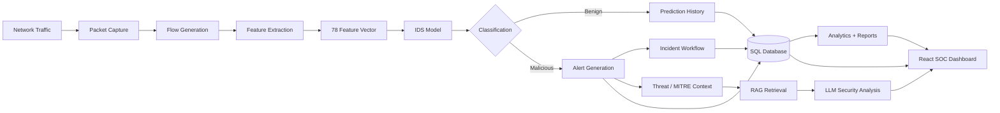

# FedSentry

[](https://github.com/harshakolachala/Intrusion-Detection-System/actions/workflows/ci.yml)


> **Federated Learning-Based Intelligent Intrusion Detection & Security Operations Platform**

FedSentry is a full-stack cybersecurity major project that combines real-time network intrusion detection, federated-learning research, SOC workflows, analytics, threat context, Retrieval-Augmented Generation (RAG), and LLM-assisted security analysis in one application.

The current platform supports live detection-engine control, 78-feature CICIDS-style prediction, prediction history, alerts, incidents, audit logs, a RAG-backed AI assistant, CSV exports, PDF security reports, WebSocket updates, and a responsive light/dark SOC interface.

---

## Platform highlights

| Capability | Current implementation |
| --- | --- |
| Real-time detection engine | Start/stop from the frontend, packet/queue telemetry and automated analysis pipeline |
| Intrusion detection | PyTorch multiclass IDS using a 78-feature input vector |
| Live Predict | Manual prediction, baseline/flood/scan presets and advanced 78-feature editor |
| Prediction History | Auto-refresh, search, benign/malicious filters, inspect and reuse metadata |
| Dashboard | SOC overview, live events, detection metrics and FedSentry Copilot entry |
| Analytics | Area, donut, bar, line, radar, radial bar, scatter and composed charts |
| Alerts | Review, filter, update status and delete detections |
| Incidents | Create, assign, triage, update, close and inspect incident tickets |
| AI Assistant | Local RAG retrieval with Groq LLM support and Gemini fallback |
| Reports | Alerts/Incidents/Predictions CSV, security-summary PDF and incident PDF |
| Authentication | JWT-based authentication and protected application routes |
| Real-time UI | WebSocket SOC events plus polling fallbacks where appropriate |
| Database | SQLAlchemy with SQLite by default and PostgreSQL-compatible configuration |
| Theme | Unified FedSentry light/dark visual system |
| CI | Backend import validation and production frontend TypeScript/Vite build |

---

## Architecture



### Real-time path

```text
Network interface
  -> packet capture
  -> flow construction
  -> feature extraction
  -> preprocessing
  -> IDS inference
  -> prediction persistence
  -> alert generation when malicious
  -> dashboard / analytics / incidents / reports
```

---

## Frontend workspaces

### Overview Dashboard

The dashboard provides the main SOC entry point with security KPIs, recent detections, live event handling, engine visibility, navigation into analytics, and direct access to the FedSentry AI assistant.

### Live Predict + Prediction History

`/predict` and `/prediction-history` share a unified inference workspace. The page supports:

- Automatic packet-capture telemetry while the engine is running
- Manual 78-feature prediction
- Connection metadata editing
- TCP, UDP and ICMP selection
- Baseline, flood and scan presets
- Full CICIDS-style feature editor
- Confidence and latency display
- Automatic prediction-history refresh
- Search and benign/malicious filters
- Historical record inspection
- Reuse of historical network metadata in Live Predict

### Analytics

FedSentry currently provides eight complementary visualization types:

1. Traffic activity area chart
2. Threat severity donut chart
3. Attack-family horizontal bar chart
4. Malicious-rate line chart
5. Security-posture radar chart
6. Threat-concentration radial bar chart
7. Traffic-volume vs risk scatter chart
8. Traffic + confidence composed chart

Analytics uses the shared theme variables, so cards, labels, chart text and surfaces adapt correctly to both light and dark mode.

### Alerts and Incidents

Security detections can be triaged through the Alerts workspace and converted into operational incident workflows. Incident records include title, description, severity, status, assignment, timestamps, resolution information and optional linkage to an alert.

### Reports & Exports

The Reports workspace can download operational data without manually querying the database.

| Report | Endpoint |
| --- | --- |
| Alerts CSV | `GET /reports/alerts.csv` |
| Incidents CSV | `GET /reports/incidents.csv` |
| Predictions CSV | `GET /reports/predictions.csv` |
| Security summary PDF | `GET /reports/security-summary.pdf` |
| Individual incident PDF | `GET /reports/incidents/{incident_id}.pdf` |

The security-summary PDF includes current platform metrics and recent security records. Individual incident reports include incident details and linked alert evidence when available.

---

## AI, RAG and LLM layer

FedSentry's assistant is designed as a cybersecurity analysis helper rather than a replacement for deterministic detection.

```text
User / security event
  -> retrieve relevant local security knowledge
  -> semantic search with SentenceTransformers + FAISS when available
  -> lexical fallback when semantic retrieval is unavailable
  -> construct grounded context
  -> call configured LLM provider
  -> return analyst-oriented explanation / mitigation guidance
```

Supported configuration:

- **Groq** as the recommended local provider
- **Gemini** as an optional fallback provider
- Hybrid, semantic or lexical RAG modes
- `all-MiniLM-L6-v2` as the default embedding model
- Deterministic fallback response when an external LLM is unavailable

Never commit real API keys. Keep them only in `backend/.env` or an appropriate secret manager.

---

## Federated-learning research component

The repository also contains the federated IDS research workflow under `backend/federated/`, including client/server training code, dataset preparation, centralized comparison, final evaluation, confusion-matrix analysis and inference benchmarking.

The recorded experiment configuration uses 78 input features and 15 traffic classes with federated aggregation across multiple clients. The project documentation records a final federated accuracy of approximately **90.16%** and weighted F1 of approximately **92.32%**, with a centralized baseline around **91.18%** accuracy and **92.92%** weighted F1.

Federated-training scripts use Flower. If you run those research scripts separately and Flower is not already installed in your environment, install the version appropriate for that training environment.

---

## Technology stack

### Backend

- Python 3.11
- FastAPI
- Uvicorn
- SQLAlchemy
- SQLite by default; PostgreSQL-compatible `DATABASE_URL`
- PyTorch
- scikit-learn, pandas and NumPy
- FAISS
- Sentence Transformers
- Groq SDK
- Google GenAI SDK
- ReportLab for PDF generation

### Frontend

- React 19
- TypeScript
- Vite
- Tailwind CSS
- Recharts
- Axios
- Lucide icons

### Security / AI

- Multiclass intrusion detection
- Federated-learning research workflow
- MITRE ATT&CK-oriented context
- Threat-intelligence integrations
- RAG knowledge retrieval
- LLM-assisted explanations
- WebSocket event delivery
- JWT authentication

---

## Quick start

### 1. Clone and enter the repository

```bash
git clone https://github.com/harshakolachala/Intrusion-Detection-System.git
cd Intrusion-Detection-System
```

### 2. Backend setup

Windows PowerShell / Command Prompt:

```bash
cd backend
python -m venv .venv
.venv\Scripts\activate
pip install -r requirements.txt
copy .env.example .env
uvicorn main:app --reload
```

Linux / macOS:

```bash
cd backend
python3 -m venv .venv
source .venv/bin/activate
pip install -r requirements.txt
cp .env.example .env
uvicorn main:app --reload
```

Backend URLs:

```text
API:     http://127.0.0.1:8000
Swagger: http://127.0.0.1:8000/docs
```

### 3. Frontend setup

Open a second terminal from the repository root:

```bash
cd frontend
npm install
npm run dev
```

Frontend:

```text
http://localhost:5173
```

### 4. Recommended first run

1. Register or log in.
2. Open the authenticated dashboard.
3. Press **Start engine** in the top navigation.
4. Verify packet count / capture state changes.
5. Open **Live Predict** and confirm new predictions appear.
6. Review **Alerts**, **Incidents** and **Analytics**.
7. Open **AI Assistant** for RAG/LLM analysis.
8. Use **Reports & Exports** to download CSV/PDF reports.
9. Press **Stop engine** when testing is complete.

> Real packet capture can require OS-level packet-capture support and sufficient permissions. On Windows, run the backend with the permissions required by the installed capture driver/environment.

---

## Environment configuration

Copy `backend/.env.example` to `backend/.env` and configure only the integrations you use.

```env
DATABASE_URL=sqlite:///./sentinel.db

LLM_PROVIDER=groq
GROQ_API_KEY=
GROQ_MODEL=openai/gpt-oss-20b

GEMINI_API_KEY=
GEMINI_MODEL=gemini-3.7-flash

RAG_MODE=hybrid
RAG_EMBEDDING_MODEL=all-MiniLM-L6-v2
LLM_MAX_TOKENS=600

ABUSEIPDB_API_KEY=
VIRUSTOTAL_API_KEY=

SECRET_KEY=change-this-to-a-long-random-secret
```

Do **not** commit `backend/.env` or any real credential.

---

## Main API groups

| Group | Prefix / endpoint |
| --- | --- |
| Authentication | `/auth` |
| Health | `/health` |
| Manual prediction | `/predict` |
| Prediction history | `/predictions` |
| Detection engine | `/engine/start`, `/engine/stop`, `/engine/status` |
| Analytics | `/analytics` |
| Alerts | `/alerts` |
| Incidents | `/incidents` |
| Audit logs | `/audit` |
| AI assistant | `/chatbot` |
| Reports | `/reports` |
| WebSocket events | `/ws/events` |

Interactive endpoint documentation is available from FastAPI at `/docs` while the backend is running.

---

## Detection-engine controls

The authenticated frontend exposes engine controls in the top navigation.

```text
Start engine
  -> backend /engine/start
  -> start capture / processing pipeline
  -> frontend polls status and displays running state

Stop engine
  -> backend /engine/stop
  -> stop packet analysis
```

The Live Predict workspace also displays packet totals, approximate packet rate, queue depth and engine state.

---

## Database

The backend uses SQLAlchemy and reads `DATABASE_URL` from the environment.

Default local configuration:

```env
DATABASE_URL=sqlite:///./sentinel.db
```

If no URL is provided, the database connection layer can fall back to a local SQLite database. PostgreSQL URLs are also supported for deployments that require a separate database server.

---

## Project structure

```text
Intrusion-Detection-System/
├── backend/
│   ├── auth/                 # Authentication and JWT flow
│   ├── database/             # SQLAlchemy connection/session/init
│   ├── federated/            # Federated IDS research and evaluation
│   ├── llm/                  # LLM provider integration
│   ├── models/               # Database models
│   ├── rag/                  # RAG retriever/context pipeline
│   ├── reports/              # CSV and PDF generators
│   ├── routes/               # FastAPI API routes
│   ├── services/             # Application services
│   ├── threat_intel/         # Threat intelligence integrations
│   ├── websocket/            # Real-time SOC event manager
│   ├── .env.example
│   ├── main.py
│   └── requirements.txt
├── frontend/
│   ├── src/
│   │   ├── api/
│   │   ├── components/
│   │   ├── context/
│   │   ├── pages/
│   │   ├── services/
│   │   └── main.tsx
│   ├── package.json
│   └── vite.config.ts
├── .github/workflows/ci.yml
├── docker-compose.yml
└── README.md
```

---

## CI

GitHub Actions runs on pushes and pull requests targeting `main`.

The current workflow performs:

```text
Backend
  pip install -r backend/requirements.txt
  python -c "import main"

Frontend
  npm ci
  npm run build
    -> TypeScript project build
    -> Vite production build
```

A green CI run therefore confirms that the current backend application imports with its declared dependencies and the frontend passes the production TypeScript/Vite build. Runtime testing of packet capture, external LLM credentials and live network behavior is still performed locally because those depend on machine-specific services and permissions.

---

## Final end-to-end validation checklist

Before a demonstration or release, validate the complete path:

```text
Login
 -> Start Engine
 -> Packet Capture
 -> Predictions
 -> Prediction History
 -> Alerts
 -> Incident workflow
 -> Analytics
 -> RAG / LLM Assistant
 -> CSV exports
 -> Security Summary PDF
 -> Incident PDF
 -> Stop Engine
```

---

## Security notes

- Use FedSentry only on systems and networks you are authorized to monitor.
- Do not commit `.env` files, API keys, passwords or tokens.
- Rotate any credential that has been accidentally exposed.
- Treat LLM output as analyst assistance; detection decisions remain grounded in the IDS and application data.
- Production deployments should use strong secrets, HTTPS, restricted CORS, proper database credentials, logging/monitoring and secret management.

---

## Future scope

Potential extensions include secure aggregation, differential privacy, malicious-client detection, geographically distributed federated clients, richer GeoIP enrichment, SOAR integrations, expanded ATT&CK automation, additional IDS datasets, online learning, stronger model calibration and production deployment hardening.

---

## License / usage

FedSentry is developed for academic, research, educational and authorized cybersecurity use.
